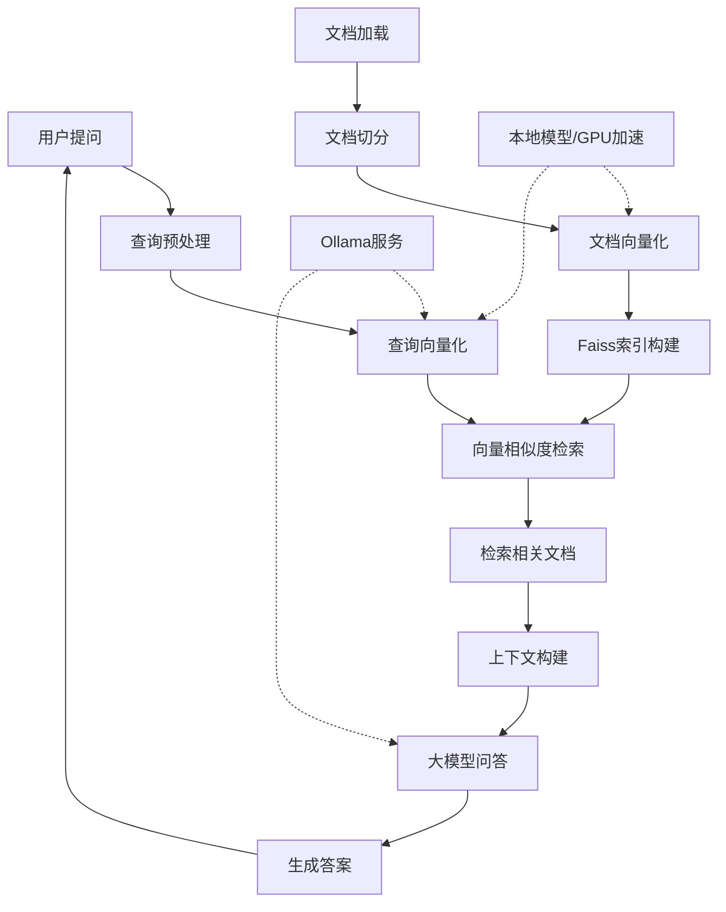

# RAG系统流程图 (Mermaid格式)

## 流程说明：

1. **文档预处理阶段**（离线）：
   - 从文档源加载数据
   - 使用RecursiveCharacterTextSplitter进行文档切分
   - 对文档块进行向量化
   - 构建Faiss向量索引

2. **问答处理阶段**（实时）：
   - 用户输入查询
   - 查询向量化
   - 通过Faiss索引检索相似文档
   - 构建上下文
   - 调用大模型生成答案
   - 返回结果给用户

3. **技术组件**：
   - 文档切分：LangChain的RecursiveCharacterTextSplitter (chunk_size=1000, chunk_overlap=100)
   - 向量化：Ollama API或本地sentence-transformers模型（支持GPU加速）
   - 索引：Faiss-CPU/FAISS-CPU
   - 问答：deepseek-r1:1.5b模型